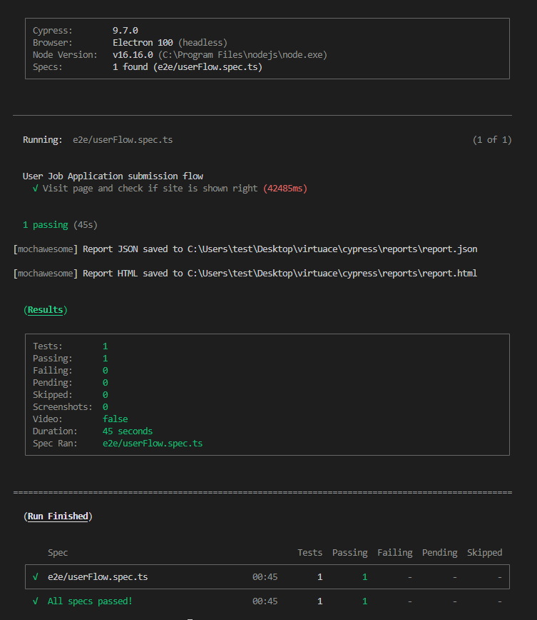

# Cypress Project

Sample test project with Cypress for testing the Iodinesoftware web-based application.

## Pre-requirements

For Windows/Mac/Linux:

You need to have node and npm installed on your computer.

For this project, the following versions of node and npm were used:

```sh
$ node -v
6.0.46+

$ npm -v
6.0.46+
```

## Installation

Run `npm i` or `yard` on root directory to install the dev dependencies.

## Tests

> Before running the tests, create a file called `cypress.env.json` in the project root directory, based on the `cypress.env.example.json` file, and update the value of the `URL` property with the web-page Url.

### Headless mode

Run `npm run cy` to run the tests in headless mode. The test results should look like the below image.



### Interactive mode

Run `npm run cy:open`, then click <kbd>Run N integration specs</kbd> to run the tests in interactive mode. You should see something like the below gif.

> Another option is run click in a specific test file to run it only.


### Reporting

After running tests we can easily get a test run report (example pic below) which will we in HTML format, for that we are using mochawesome reporting tool, you can easily change it to any in cypress.json file, especially in:

<kbd>
"reporter": "mochawesone",
    "chromeWebSecurity": false,
    "reporterOptions": {
        "charts": false,
        "html": true,
        "json": true,
        "reportDir": "cypress/reports",
        "reportFilename": "report",
        "overwrite": true
}
</kbd>

Notes for Virtuace Team <3, Cypress don't really likes Iframes, so it was quite complicated to have 100% ideal solutions for main page, but i tried to have it maximum stable! 

___

Made with 💚 by [Davit Danelia](https://medium.com/@danelia)